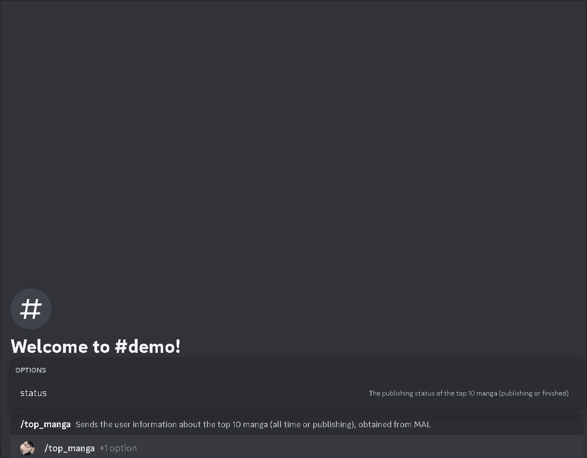

## Overview

Sends the user information about the top 10 manga (all time or publishing), obtained from MAL

| argument name |                            description                             |
| :-----------: | :----------------------------------------------------------------: |
|   `status`    | The publishing status of the top 10 manga (publishing or finished) |

`Cooldown`: 10 seconds

`Required User Permissions`: None

## API Reference

- JikanAPI ([Documentation](https://docs.api.jikan.moe/) | [GitHub Repo](https://github.com/jikan-me/jikan-rest)

## Demo

