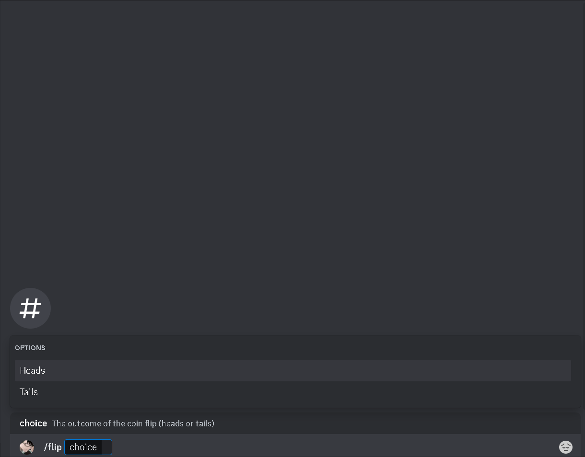

## Overview

Flip a coin and guess the outcome.

| argument name |                  description                  |
| :-----------: | :-------------------------------------------: |
|   `choice`    | The outcome of the coin flip (heads or tails) |

## API Reference

No external APIs were used for this command.

## Demo

