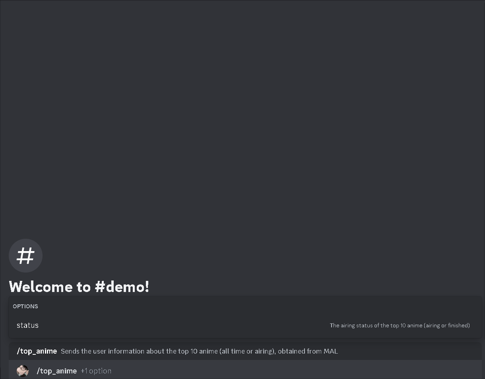

## Overview

Sends the user information about the top 10 anime (all time or airing), obtained from MAL.

| argument name |                        description                         |
| :-----------: | :--------------------------------------------------------: |
|   `status`    | The airing status of the top 10 anime (airing or finished) |

`Cooldown`: 10 seconds

`Required User Permissions`: None

## API Reference

This command was made possible by the following API:

- JikanAPI ([Documentation](https://docs.api.jikan.moe/) | [GitHub Repo](https://github.com/jikan-me/jikan-rest)

## Demo

