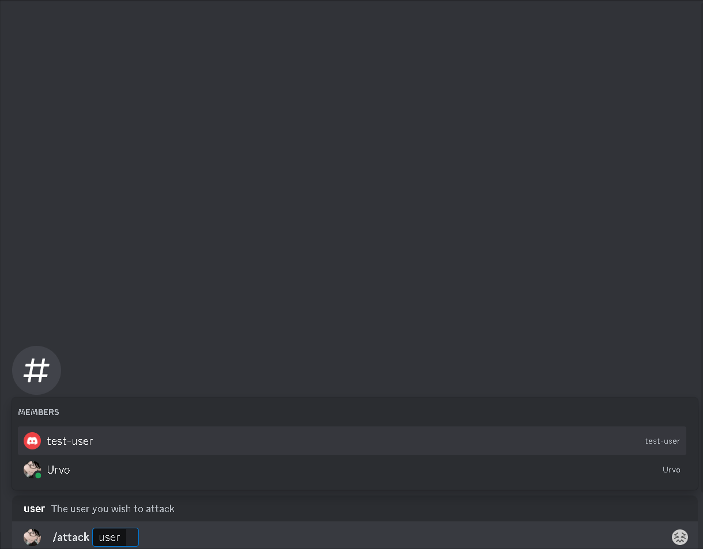

## Overview

Deploy your troops against another user, may the odds be in your favor.

| argument name |         description         |
| :-----------: | :-------------------------: |
|    `user`     | The user you wish to attack |

`Cooldown`: 10 minutes

`Required User Permissions`: None

## API Reference

No external APIs were used for this command.

## Demo

