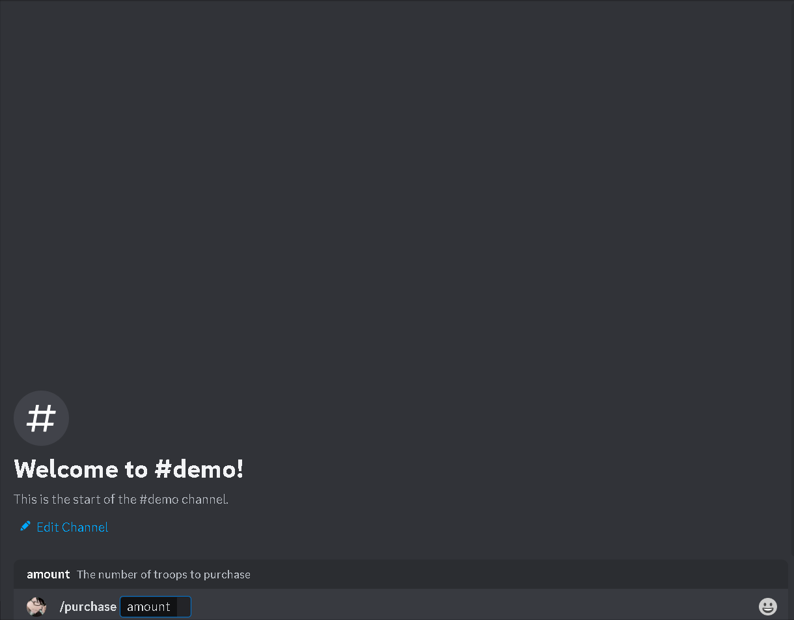

## Overview

Purchase troops to add to your army.

| argument name |           description            |
| :-----------: | :------------------------------: |
|   `amount`    | The number of troops to purchase |

`Cooldown`: 10 seconds

`Required User Permissions`: None

## API Reference

No external APIs were used for this command.

## Demo

