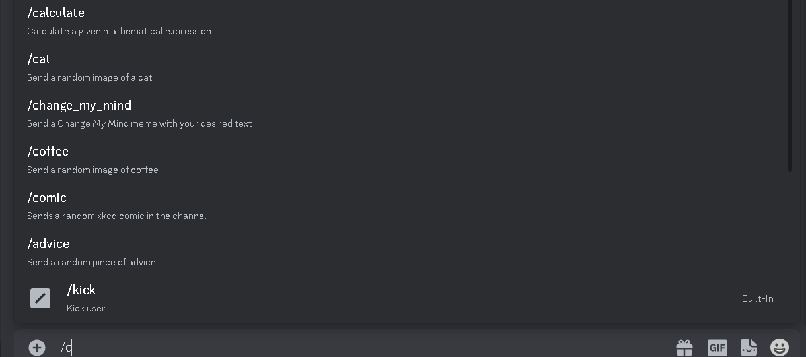

## Overview

Create a new channel of the specified type.

| argument name  |                 description                  |
| :------------: | :------------------------------------------: |
| `channel_name` | The name of the channel that will be created |
| `channel_type` | The type of the channel that will be created |

`Cooldown`: 10 seconds

`Required User Permissions`: None

## API Reference

No external APIs were used for this command.

## Demo

