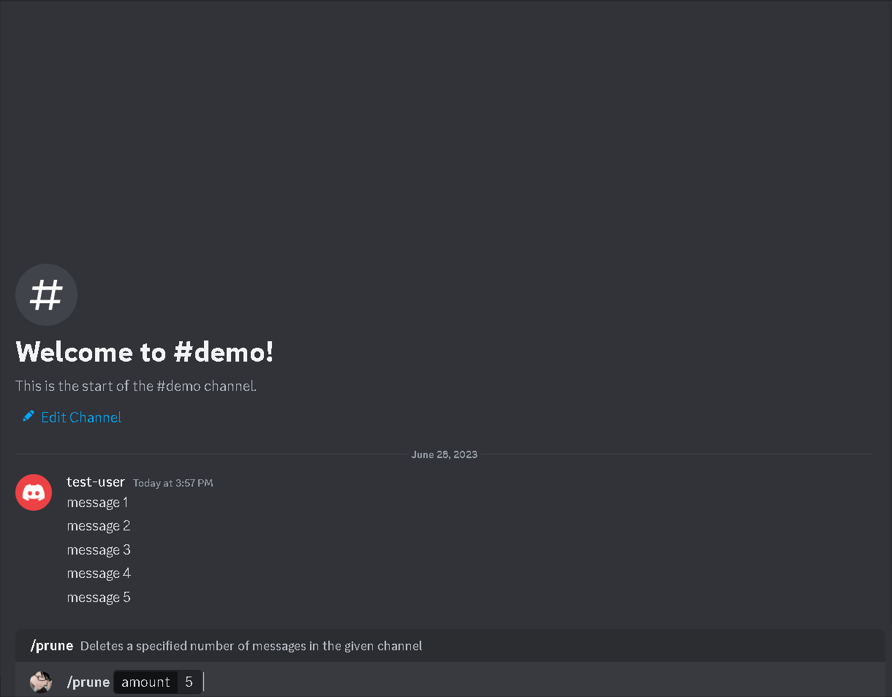

## Overview

Deletes a specified number of messages in the given channel.

`Cooldown`: 10 seconds

`Required User Permissions`: None

## API Reference

No external APIs were used for this command.

## Demo

